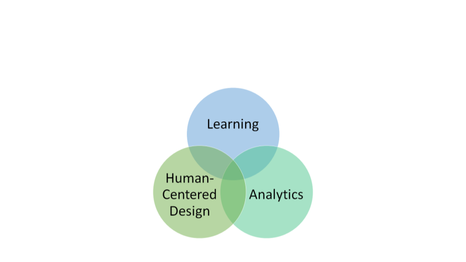
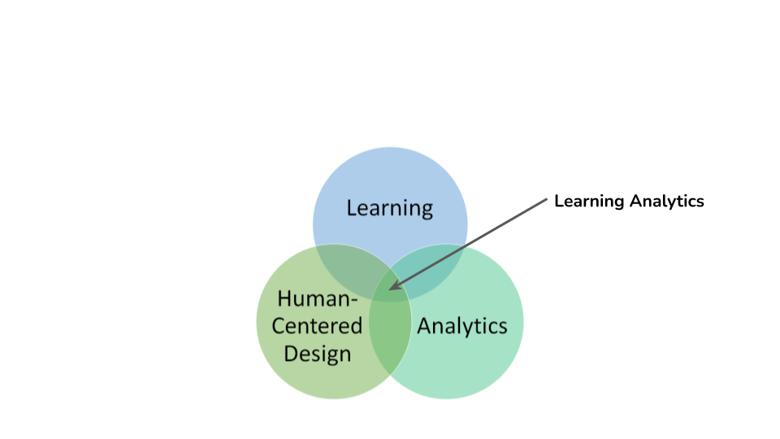
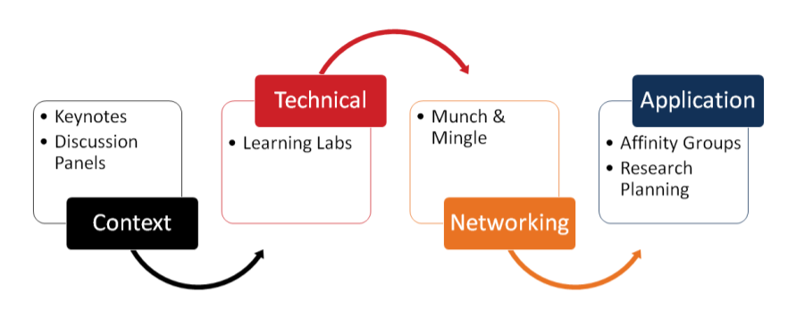
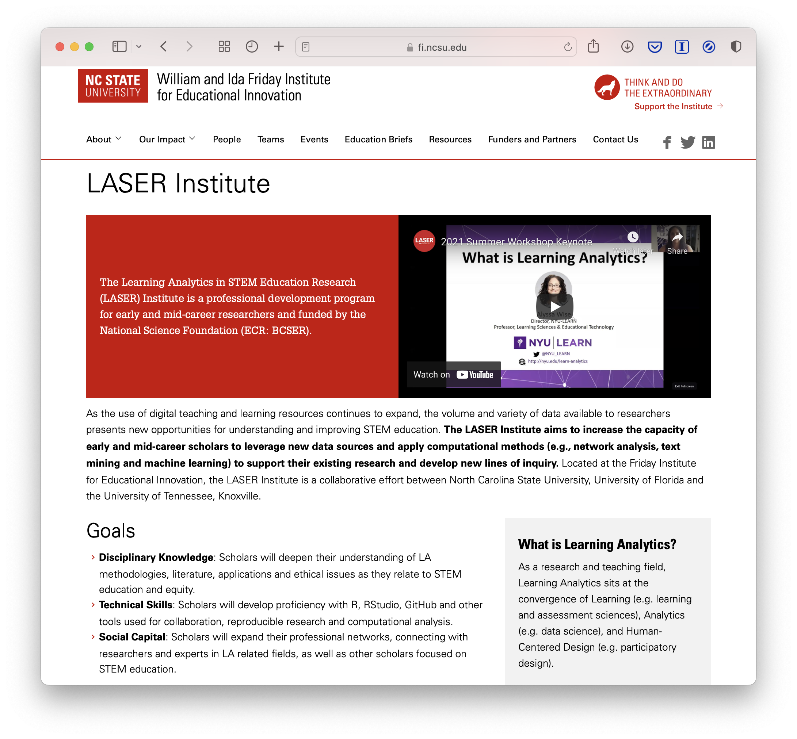

class: clear, title-slide, inverse, center, top, middle

```{r setup, include=FALSE}
knitr::opts_chunk$set(echo = FALSE)
```

```{r, echo=FALSE}
# then load all the relevant packages
pacman::p_load(pacman, knitr, tidyverse, xaringan, xaringanExtra)
```

```{r xaringan-panelset, echo=FALSE}
xaringanExtra::use_panelset()
```

```{r xaringanExtra-clipboard, echo=FALSE}
# these allow any code snippets to be copied to the clipboard so they 
# can be pasted easily
htmltools::tagList(
  xaringanExtra::use_clipboard(
    button_text = "<i class=\"fa fa-clipboard\"></i>",
    success_text = "<i class=\"fa fa-check\" style=\"color: #90BE6D\"></i>",
  ),
  rmarkdown::html_dependency_font_awesome()
)
```
```{r xaringan-extras, echo=FALSE}
xaringanExtra::use_tile_view()

```

# `r rmarkdown::metadata$title`
----
### `r rmarkdown::metadata$author`
### `r format(Sys.time(), "%B %d, %Y")`
<br>
### Slides: [go.ncsu.edu/pprs-laser](https://www.fi.ncsu.edu/projects/laser-institute/)

---
# Agenda

<br>
## Part 1: Pandemic Pedagogy
## 2. Looking Back on 2021
## 3. Looking Ahead to 2022
## 4. Learning Lab Demo


---
class: clear, middle, center


.center[ 
Meet Our Team

]


---
class: clear, inverse, middle, center

# Part 1: The (Virtual) LASER Insitute 


Curriculum, Pedagogy, and Interactive Demo


---
class: no-logo
# What is the LASER Institute?
The [Learning Analytics in STEM Education Research (LASER) Institute](https://www.fi.ncsu.edu/projects/laser-institute/) is a professional development program for early and mid-career researchers and funded by the National Science Foundation (ECR: BCSER).

.pull-left[
.navy[**What:**]
- Build disciplinary knowledge
- Develop proficient technical skills
- Expand professional networks (social capital/collaboration)
]

.pull-right[
.navy[**How:**]
- year-long program
 - Summer workshop at the Friday Institute
 - Online community of practice
- $1500 participant stipend
]

---
# What is Learning Analytics?



---
class: animated, fadeIn
# What is Learning Analytics? 



???
As a research and teaching field, Learning Analytics sits at the convergence of Learning (e.g. educational research, learning and assessment sciences, educational technology), Analytics (e.g. statistics, visualization, computer/data sciences, artificial intelligence), and Human-Centered Design (e.g. usability, participatory design, sociotechnical systems thinking).

---
# Summer Workshop

.center[]

---
class: clear, center, middle

.font150[Disciplinary Knowledge]

---
# Key Uses and Methodologies

.pull-left[
## **Uses:** 
- Prediction models for student success
- Supporting lifelong learning 
- Empirical support for pedagogical innovations
]

.pull-right[
## **Methodologies: **
- Descriptive analytics 
 - What happened in the past?
- Diagnostic Analytics 
 - Why did it happen?
- Prescriptive Analytics 
 - What can happen in the future?
]

???
Descriptive - student satisfaction surveys; all stages of the student life cycle
Diagnostic - drill-down, data discovery, data mining; learning management metrics
Prescriptive - machine learning, algorithms, computational modeling

---
class: clear, center, middle

.font150[Technical Skills]

---
# The Scholar's Toolkit

The goal here really is centered around building reproducible research.
<br/><br/>
.center[


]

---
class: clear, middle, center

What did this look like in a remote context?

https://rstudio.cloud/spaces/140883

---
class: clear, center, middle

.font150[Social Capital]

---
# Communities of Practice

.pull-left[Scholars could "mingle" in sessions set aside for building potential research partnerships. 

Breakout rooms used for affinity groups for research topic areas.

Scholars were also encouraged to engage one another and the project team using the Slack collaboration platform.]
.pull-right[]

---
# Lessons Learned from Summer 2021

- Participants found that the keynotes and presentations particularly impactful to their understanding of LA methodologies.

- Expressed a desire for more practice with topic areas (e.g., machine learning or text mining) or greater exposure to fewer focus areas.

- Highlighted a need for access to resources such as articles, videos, and/or real research projects.

- Scaffolding according to experience with R

- Coding in the cloud had its challenges!

---
class: clear, center, middle, no-logo


---
class: clear, inverse, center, middle

.font150[Looking Ahead to 2022]

---
# Virtual Residue

What elements from our virtual year are worth retaining? 
- [RStudio Cloud](https://rstudio.cloud) despite it's many bugs
- The flexibility and differentiation virtual compelled us to accommodate. 
- [Virtual Case studies](https://laser-institute.github.io/text-mining/keys/tm-learning-lab-2-key.html), though for badging and accountability. 
- Expanding curation and development of online resources.  
- To Slack or not to Slack? That really is a question mark. 


---
# Community Participate(ion)
What elements from our virtual year need better attention? 
- More opportunities for personal and professional networking
- Setting community norms and expectations for participation
- More structured activities for supporting professional collaboration

We've contracted with [Participate, Inc.](https://www.participate.com) to help us develop in-person community-building activities for summer workshop and  activities during the academic year for the Online Community of Practice. 

---
# Summer Workshop Changes
So what changes are we making for the coming year?
- Virtual only as a last resort 
- 1 week, definitely not 2
- More Content but Less Content 
- Badging & Accountability
- Better Balance among Program Goals  

[Summer Schedule and Topics for 2022](https://docs.google.com/document/d/145nCvK2f_I_25qNq7hx-89KChxDbvzVImIxXFAi0Bk4/edit#heading=h.61b4ys86pca0)

---
class: clear, middle

.center[
Learn More



https://www.fi.ncsu.edu/projects/laser-institute/

]

---
# Resources Mentioned Here Today

- https://www.r-project.org/

- https://www.rstudio.com/

- https://rstudio.cloud/

- https://github.com/

---
class: inverse, clear, center

## .font130[.center[**Thank you!**]]

.left-col[
.center[<br/>**Shaun Kellogg**<br/><mailto:sbkellog@ncsu.edu>]
]
.center-col[
.center[]
]
.right-col[
.center[<br/>**Jennifer Houchins**<br/><mailto:jkhouchi@ncsu.edu>]
]
<br/><br/><br/><br/><br/>

.pull-left-narrow[<br/>.center[ ]]

.pull-right-wide[
.left[.font70[
This work was supported by the National Science Foundation grant DRL-2025090 (ECR:BCSER). Any opinions, findings, and conclusions expressed in this material are those of the authors and do not necessarily reflect the views of the National Science Foundation.
]]
]