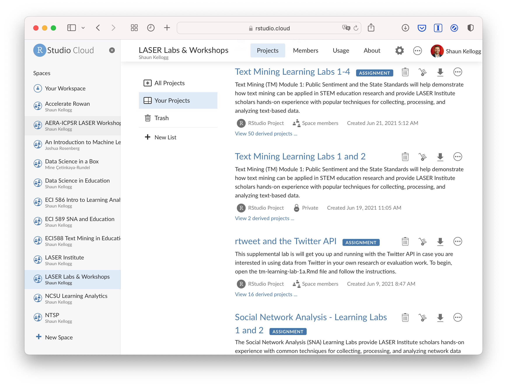
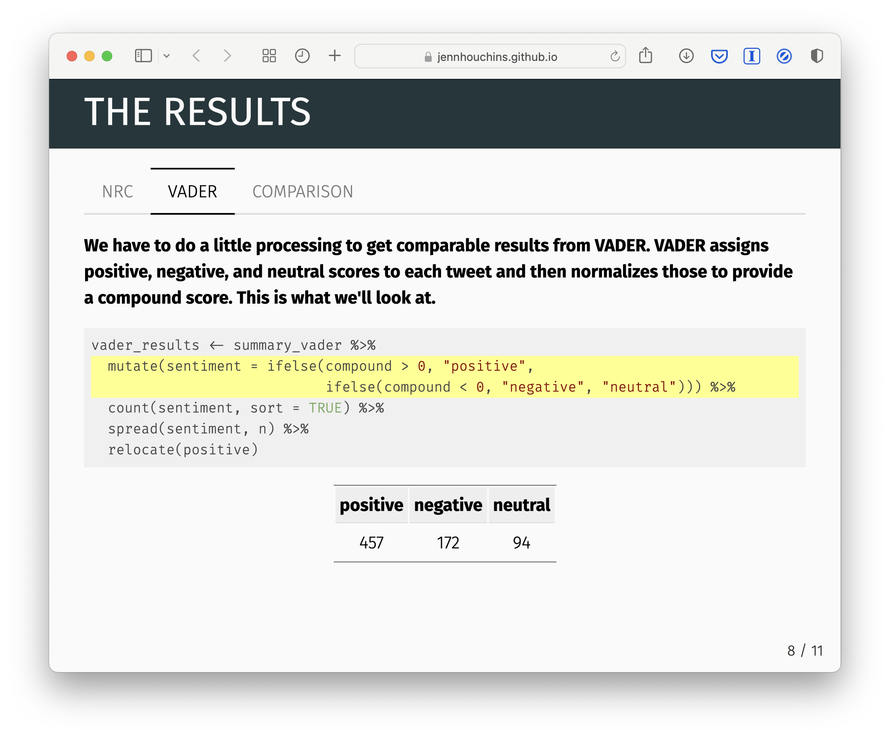

class: clear, title-slide, inverse, center, top, middle

```{r setup, include=FALSE}
knitr::opts_chunk$set(echo = FALSE)
```

```{r, echo=FALSE}
# then load all the relevant packages
pacman::p_load(pacman, knitr, tidyverse, xaringan, xaringanExtra)
```

```{r xaringan-panelset, echo=FALSE}
xaringanExtra::use_panelset()
```

```{r xaringanExtra-clipboard, echo=FALSE}
# these allow any code snippets to be copied to the clipboard so they 
# can be pasted easily
htmltools::tagList(
  xaringanExtra::use_clipboard(
    button_text = "<i class=\"fa fa-clipboard\"></i>",
    success_text = "<i class=\"fa fa-check\" style=\"color: #90BE6D\"></i>",
  ),
  rmarkdown::html_dependency_font_awesome()
)
```
```{r xaringan-extras, echo=FALSE}
xaringanExtra::use_tile_view()

```

# `r rmarkdown::metadata$title`
----
### `r rmarkdown::metadata$author`
### `r format(Sys.time(), "%B %d, %Y")`
<br>
### Slides: [go.ncsu.edu/ncsu-la](https://go.ncsu.edu/ncsu-la)

---
class: clear, middle, center

.center[ ## .font130[.center[**Meet the Team**]]

]


---
# Agenda

.pull-left[
## Core Curriculum 
- Targeted Learners
- Goals & Objectives
- Core Content
]

.pull-right[
## Online Pedagogy 
- Reading & Discussion
- Coding Case Studies   
- Data Products 

]

---
# Core Curriculum 

.panelset[

.panel[.panel-name[Learners]

.pull-left[
The [Learning Analytics Certificate](https://ced.ncsu.edu/graduate/programs/certificate/learning-analytics/) is designed for: 
- K-16 researchers & practitioners
- new to LA 
- basic grasp of stats
- interest in new data sources & techniques
]

.pull-right[
.center[]
.center[[Student Success Story](https://online-distance.ncsu.edu/online-graduate-appreciates-authentic-course-content/)]
]
]


.panel[.panel-name[Goals & Objectives]
1. **Conceptual Foundations:** Describe Learning Analytics as a discipline that addresses problems, questions, and issues in education;
2. **Data Sources & Measures:** Identify and appropriately use educational data sources (e.g. learning management systems) and associated measures;
3. **Tool Proficiency:** Efficiently and effectively apply up-to-date software and tools (i.e. RStudio, GiHub) to implement LA workflows;
4. **Processes & Techniques:** Understand and apply analytic processes and computational techniques to understand and improve learning contexts;
5. **Communication:** Clearly communicate analyses and recommendations that provide actionable insight for a range of education stakeholders.
]

.panel[.panel-name[Content Areas]

.pull-left[
## Discplinary
- Data Sources in LA
- Research-Practice Partnerships
- Analytics Workflows
- Legal & Ethical Considerations
]


.pull-right[
## Methodological
- ECI 586 Foundations
- ECI 587 Machine Learning
- ECI 588 Text Mining
- ECI 589 Network Analysis
]
]


]


---
# Online Pedagogy

.panelset[

.panel[.panel-name[Reading & Discussion]

- Introduces **terminology, core concepts, and applications** of an analytical approach through readings, course videos, and discussion. 
- Students engage in **informal discussion with peers**. 
- Focused on **set of essential questions** to address 
- Students encouraged to explore their **personal areas of interest**. 
]

.panel[.panel-name[Coding Case Studies]

.pull-left[
Provide hands-on R experience to: 
- conduct reproducible research 
- apply computational techniques
- work with big (and small) data 
- solve practical problems 
- communicate findings to varied audiences

]

.pull-right[
.center[]
.center[[Fun Example](https://sbkellogg.github.io/eci-588/unit-2/unit-2-walkthrough.html#5_COMMUNICATE)]
]
]

.panel[.panel-name[Data Products]

.pull-left[
1. Identity a data source.
1. Formulate a question.
1. Analyze the data. 
1. Create a data product. 
1. Share your findings.
1. Provide some feedback. 

]

.pull-right[
.center[]
.center[[Student Example](https://jennhouchins.github.io/Sentiments/SentimentAnalysisinR.html#1)]
]


]


]


---
class: clear, middle, center

.center[ ## .font130[.navy[.center[**Interactive Demo!**]]]

https://go.ncsu.edu/pprs-demo
]


---
class: clear, center

## .font130[.center[**Thank you!**]]


.center[<br/>**Shaun Kellogg**<br/><mailto:sbkellog@ncsu.edu>]
